# Audio/Video services (av-services)  

# Table of Contents
- [Introduction](#introduction)
- [Overview](#Overview)
- [Samples of Audio/Video components](#samples-of-audiovideo-components)
- [Using dev container](#using-dev-container)
- [How to install, deploy, test the Audio/Video components with avtool.sh](#how-to-install-deploy-test-the-audiovideo-components-with-avtoolsh)
- [Using Github Action and Azure DevOps pipelines to test the av-services](#using-github-action-and-azure-devOps-pipelines-to-test-the-av-services)
- [Next Steps](#next-steps)
 
# Introduction
This repository (av-services) contains samples of software components which could be used to create Audio/Video workflows. Most of those components are based on Open Source libraries or tools running in different environments like virtual machines, containers.  
With those Audio/Video components, it's possible to provide services like:
- RTMP to RTSP protcol adaptor 
- RTMP Streamer from a Video file 
- RTMP Receiver into MP4 files on Azure Storage 

# Overview
This chapter describes a list of components which could be used to create an Audio/Video workflow.

##  Audio/Video protocol adaptor client 
The Audio/Video Protocol Adaptor Client will support :
- An Input flow defined with a name, the content (audio only, video only, audio/video), the protocol, the target parameters (udp port, tcp port, ip address,...)
- An Output flow defined with a name, the content (audio only, video only, audio/video), the protocol different from the input protocol, the target parameters (udp port, tcp port, ip address,...)

The Audio/Video Protocol Adaptor Client runs in a specific environment:
- Operating System: Linux, Windows, MacOS
- Docker Container 

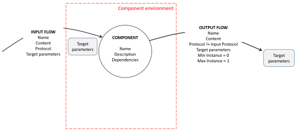

##  Audio/Video protocol adaptor server 
The Audio/Video Protocol Adaptor Server will support :
- An Input flow defined with a name, the content (audio only, video only, audio/video), the protocol, the target parameters (udp port, tcp port, ip address,...)
- An Output flow defined with a name, the content (audio only, video only, audio/video), the protocol different from the input protocol, the source parameters (udp port, tcp port, ip address,...)

The Audio/Video Protocol Adaptor Server runs in a specific environment:
- Operating System: Linux, Windows, MacOS
- Docker Container 

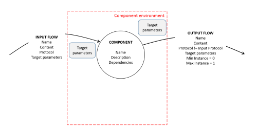

##  Audio/Video source server  
The Audio/Video Source Server will support :
- An Output flow defined with a name, the content (audio only, video only, audio/video), the source parameters (udp port, tcp port, ip address,...)

The Audio/Video Source Server runs in a specific environment:
- Operating System: Linux, Windows, MacOS
- Docker Container 

Usually the Source Server use a local file to generate the output flow. It could also be a Tuner.  

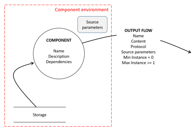

##  Audio/Video splitter server  

The Audio/Video Splitter Server will support :
- An Input flow defined with a name, the content (audio only, video only, audio/video), the protocol, the target parameters (udp port, tcp port, ip address,...)
- The Output flows defined with a name, the content (audio only, video only, audio/video), the protocol is the same as the protocol for the input protocol, the source parameters (udp port, tcp port, ip address,...)

You can have several instances of the Output flow to deliver the same Audio/Video stream to several recipients.

The Audio/Video Splitter Server runs in a specific environment:
- Operating System: Linux, Windows, MacOS
- Docker Container 


##  Audio/Video renderer client  
The Audio/Video Renderer Client will support :
- An Input flow defined with a name, the content (audio only, video only, audio/video), the protocol, the source parameters (udp port, tcp port, ip address,...)

This component will render the audio/video content using an hardware device.

The Audio/Video Renderer Client runs in a specific environment:
- Operating System: Linux, Windows, MacOS
- Docker Container 


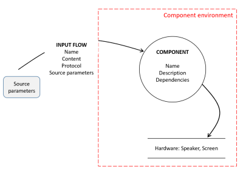


##  Audio/Video renderer server  
The Audio/Video Renderer Client will support :
- An Input flow defined with a name, the content (audio only, video only, audio/video), the protocol, the target parameters (udp port, tcp port, ip address,...)

This component will render the audio/video content using an hardware device.

The Audio/Video Renderer Server runs in a specific environment:
- Operating System: Linux, Windows, MacOS
- Docker Container 


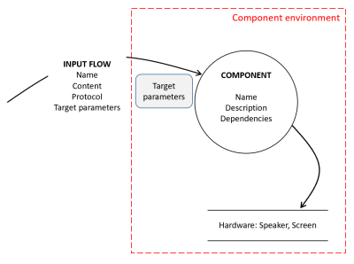

##  Audio/Video receiver client  
The Audio/Video Renderer Client will support :
- An Input flow defined with a name, the content (audio only, video only, audio/video), the protocol, the source parameters (udp port, tcp port, ip address,...)

This component will capture the incoming audio/video content and store it on a storage device.

The Audio/Video Receiver Client runs in a specific environment:
- Operating System: Linux, Windows, MacOS
- Docker Container 

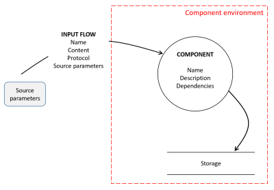

# Samples of Audio/Video components 

This repository contains samples of Audio/Video services based on Open Source libraries or tools. With those Audio/Video services, it's possible to support scenarios like:
- Audio/Video Gateway: for instance RTMP to RTSP Gateway
- Audio/Video Streamer: for instance RTMP Streamer from Video file 
- Audio/Video Receiver: for instance RTMP Receiver into MP4 files in Azure Storage 


Those Audio/Video services are running in:
- [Azure Virtual Machine](./envs/vm/azure-vm/README.md) 
- [Docker Containers](./envs/container/docker/README.md)
- [Azure IoT Edge](./envs/container/azure-iot-edge/README.md)
  
The following audio/video services are supported:
- Audio/Video Gateway: RTMP ingress/RTMP egress  
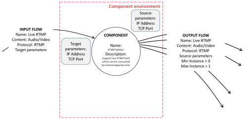
- Audio/Video Gateway: RTMP ingress/HLS egress  
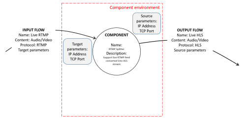 
- Audio/Video Gateway: RTMP ingress/RTSP egress   
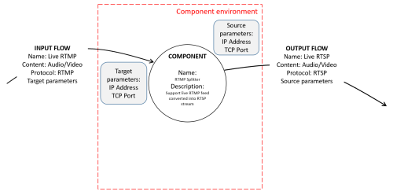 
- Audio/Video Streamer: MP4 file RTMP Source server  
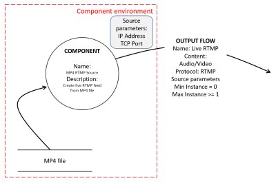 
- Audio/Video Receiver: RTMP ingress/MP4 files in Azure Storage  
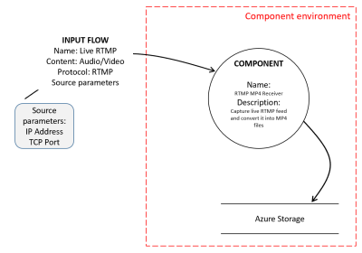 

# Using dev container
This av-services repository contains a folder called ".devcontainer". 
When you'll open the project with Visual Studio Code, it will ask you to open the project in container mode provided some pre-requisites are installed on your machine.
## installing pre-requisites
You need to install the following pre-requisite on your machine

1. Install and configure [Docker](https://www.docker.com/get-started) for your operating system.

   - Windows / macOS:

     1. Install [Docker Desktop](https://www.docker.com/products/docker-desktop) for Windows/Mac.

     2. Right-click on the Docker task bar item, select Settings / Preferences and update Resources > File Sharing with any locations your source code is kept. See [tips and tricks](https://code.visualstudio.com/docs/remote/troubleshooting#_container-tips) for troubleshooting.

     3. If you are using WSL 2 on Windows, to enable the [Windows WSL 2 back-end](https://docs.docker.com/docker-for-windows/wsl/): Right-click on the Docker taskbar item and select Settings. Check Use the WSL 2 based engine and verify your distribution is enabled under Resources > WSL Integration.

   - Linux:

     1. Follow the official install [instructions for Docker CE/EE for your distribution](https://docs.docker.com/get-docker/). If you are using Docker Compose, follow the [Docker Compose directions](https://docs.docker.com/compose/install/) as well.

     2. Add your user to the docker group by using a terminal to run: sudo usermod -aG docker $USER

     3. Sign out and back in again so your changes take effect.

2. Install [Visual Studio Code](https://code.visualstudio.com/).

3. Install the [Remote Development extension pack](https://marketplace.visualstudio.com/items?itemName=ms-vscode-remote.vscode-remote-extensionpack)
## Using av-service devcontainer

1. Launch Visual Studio Code in the folder where you stored the av-services repository

    ```bash
        c:\git\av-services> code .
    ```

2. Once Visual Studio Code is launched, you should see the following dialgo box:

    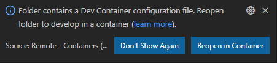

3. Click on the button 'Reopen in Container'
4. Visual Studio Code will now open the devcontainer. If it's the first time you open the project in container mode, it will first build the container.
5. Once the container is loaded, you can open a new terminal (Terminal -> New Terminal).
6. You have access to the tools installed in the devcontainer like ffmpeg, az client,... You could use this devcontainer to stream video directly towards the virtual machines or containers  in Azure. 

    ```bash
        avuser@d0b2b4ea7293:/avworkspace$ ffmpeg 
    ```

# How to install, deploy, test the Audio/Video components with avtool.sh 
In order to easily test those Audio/Video components, each component is delivered with a bash file called avtool.sh which could be used to :
- install the pre-requisites: it could deployed Azure CLI, Docker, ...
- deploy/undeploy  the component: it could deploy a virtual machine, a container,...
- start/stop the component
- get the status of the component (running, exited, ...)
- test the component

In order to use this bash file avtool.sh you need an Ubuntu 20.04 LTS machine, sub-system or virtual machine.
The subsequent paragraphs will describe how to use avtool.sh.

## Installing the pre-requisites on the host machine
Follow the steps below to install the pre-requities.

1. Ensure git is installed running the following command

```bash
    sudo apt-get install git
```

2. Clone the av-services repository on your machine

```bash
    mkdir $HOME/git
    cd $HOME/git
    git clone https://github.com/flecoqui/av-services.git
    cd av-services/envs/container/docker/av-ffmpeg/alpine 
```
3. Change to a directory containing a avtool.sh file.  
For instance: 

```bash
    cd av-services/envs/container/docker/av-ffmpeg/alpine 
```

3. Run avtool.sh -a install to install the pre-requisite.
For instance: docker 

```bash
    ./avtool.sh -a install
```

## Deploying/Undeploying the av-service 
Once the pre-requisites are installed, you can build and run the av-service component.


1. Run the following command to build and run the container

```bash
    ./avtool.sh -a deploy
```

When you run avtool.sh for the first time, it creates a file called .avtoolconfig to store the av-service  configuration. Each service use its own .avtoolconfig. 
For instance:

```bash
    AV_IMAGE_NAME=av-ffmpeg-alpine
    AV_IMAGE_FOLDER=av-services
    AV_CONTAINER_NAME=av-ffmpeg-alpine-container
    AV_VOLUME=data1
    AV_FFMPEG_COMMAND="ffmpeg -y -nostats -loglevel 0  -i ./camera-300s.mkv -codec copy /data1/camera-300s.mp4"
    AV_TEMPDIR=/tmp/tmp.TblgL0Cm4d
```

If you change to content of file .avtoolconfig, you can change the configuration of the av-service for the next call to avtool.sh.


## Starting/Stopping av-ffmpeg alpine service
Once the av-service is built, you can stop and start the av-service.


1. Run the following command to start the av-service

```bash
    ./avtool.sh -a start
```

2. If the av-service is still running, you can run the following command to stop the av-service 

```bash
    ./avtool.sh -a stop
```

3. You can run the following command to get the status of the av-service 

```bash
    ./avtool.sh -a status
```

## Testing av-ffmpeg alpine service
Once the av-service is built, you can test the av-service .

1. Run the following command to test the container

```bash
    ./avtool.sh -a test
```

# Using Github Action and Azure DevOps pipelines to test the av-services
This chapter describes how to automate the tests of the av-services using Azure DevOps pipeline and Github Action pipelines.
Currently the repository contains the following pipelines:

- Github Action pipeline for docker av-services
- Github Action pipeline for Azure virtual machine av-services
- Github Action pipeline for Azure Iot Edge Live Video Analytics av-services
- Azure DevOps pipeline for docker av-services
- Azure DevOps pipeline for Azure virtual machine av-services
- Azure DevOps pipeline for Azure Iot Edge Live Video Analytics av-services

## Creating the Service Principal for the pipelines Azure Authentication  
For the following pipelines, an authentication with Azure is required:
- Github Action pipeline for Azure virtual machine av-services
- Github Action pipeline for AZure Iot Edge Live Video Analytics av-services
- Azure DevOps pipeline for Azure virtual machine av-services
- Azure DevOps pipeline for AZure Iot Edge Live Video Analytics av-services

As the deployment of Live Video Analytics requires the creation of a service principal, the service principal which will be used for the Azure authentication will have the following permissions:
- Microsoft Graph API Application.ReadWrite.OwnedBy permission  
- Azure Active Directory Graph API Application.ReadWrite.OwnedBy permission

The creation of this service principal with your Azure Account may fail, in that case, you'll need to contact your Azure Active Directory Administrator to create the Service Principal for you.

In order to create this service principal you can use the following bash file: [pipelines/utils/createrbacsp.sh](pipelines/utils/createrbacsp.sh)

Before running this bash file you need to be connected with your Azure Account using Azure CLI. Run 'az login' in your linux environment.

```bash
    az login
```

Once you are connected with Azure, you can run the following bash to create the Service Principal:

```bash
    pipelines/utils/createrbacsp.sh -s <Azure-Subscription-Id> -a <Service-Principal-Name>
```
where \<Azure-Subscription-Id\> is the subscriptionId of your Azure Account and \<Service-Principal-Name\> the name of the service principal which will be created. 
This bash file will display all the information required for the Azure authentication with github Action pipeline and Azure DevOps pipeline.

For instance:
```bash
    pipelines/utils/createrbacsp.sh -s d3814ade-afe8-4260-9b5f-************ -a sp-av-service
```

The bash file will display the following information:
```bash
    Creating Service Principal for:
    Service Principal Name: sp-av-service
    Subscription: ********-****-****-****-************
    TenantId : ********-****-****-****-************

    Create Service Principal:

    WARNING: The output includes credentials that you must protect. Be sure that you do not include these credentials in your code or check the credentials into your source control. For more information, see https://aka.ms/azadsp-cli
    Service Principal created: ********-****-****-****-************
    Service Principal secret: ************
    Service Principal objectId: ********-****-****-****-************
    API_Microsoft_GraphId: 6a912336-0d0c-4caa-826c-9056b262adf6
    API_Windows_Azure_Active_DirectoryId: 02a23de7-025e-4637-a30a-f56d585b9224
    PERMISSION_MG_Application_ReadWrite_OwnedBy: 18a4783c-866b-4cc7-a460-3d5e5662c884
    PERMISSION_AAD_Application_ReadWrite_OwnedBy: 824c81eb-e3f8-4ee6-8f6d-de7f50d565b7

    Request Microsoft Graph API Application.ReadWrite.OwnedBy Permissions

    WARNING: Invoking "az ad app permission grant --id ********-****-****-****-************ --api 00000003-0000-0000-c000-000000000000" is needed to make the change effective

    Request Azure Active Directory Graph API Application.ReadWrite.OwnedBy Permissions


    Grant Application and Delegated permissions through admin-consent

    Wait 60 seconds to be sure Service Principal is present on https://graph.microsoft.com/
    az rest --method GET --uri https://graph.microsoft.com/v1.0/servicePrincipals/********-****-****-****-************/appRoleAssignments | jq -r '.value[] | select(.principalId == "********-****-****-****-************" and .resourceId == "6a912336-0d0c-4caa-826c-9056b262adf6" and .appRoleId == "18a4783c-866b-4cc7-a460-3d5e5662c884")'
    az rest --method POST --uri https://graph.microsoft.com/v1.0/servicePrincipals/********-****-****-****-************/appRoleAssignments --body '{"principalId": "********-****-****-****-************","resourceId": "6a912336-0d0c-4caa-826c-9056b262adf6","appRoleId": "18a4783c-866b-4cc7-a460-3d5e5662c884"}'
    az rest --method GET --uri https://graph.microsoft.com/v1.0/servicePrincipals/********-****-****-****-************/appRoleAssignments | jq -r '.value[] | select(.principalId == "********-****-****-****-************" and .resourceId == "02a23de7-025e-4637-a30a-f56d585b9224" and .appRoleId == "824c81eb-e3f8-4ee6-8f6d-de7f50d565b7")'
    az rest --method POST --uri https://graph.microsoft.com/v1.0/servicePrincipals/********-****-****-****-************/appRoleAssignments --body '{"principalId": "********-****-****-****-************","resourceId": "02a23de7-025e-4637-a30a-f56d585b9224","appRoleId": "824c81eb-e3f8-4ee6-8f6d-de7f50d565b7"}'

    Assign role "Owner" to service principal


    Information for the creation of an Azure DevOps Service Connection:

    Service Principal Name: sp-av-service
    Subscription: ********-****-****-****-************
    Subscription Name: ************
    AppId: ********-****-****-****-************
    Password: ************
    TenantID: ********-****-****-****-************


    Information for the creation of Github Action Secret AZURE_CREDENTIALS:

    {
    "clientId": "********-****-****-****-************",
    "clientSecret": "************",
    "subscriptionId": "********-****-****-****-************",
    "tenantId": "********-****-****-****-************",
    "activeDirectoryEndpointUrl": "https://login.microsoftonline.com",
    "resourceManagerEndpointUrl": "https://management.azure.com/",
    "activeDirectoryGraphResourceId": "https://graph.windows.net/",
    "sqlManagementEndpointUrl": "https://management.core.windows.net:8443/",
    "galleryEndpointUrl": "https://gallery.azure.com/",
    "managementEndpointUrl": "https://management.core.windows.net/"
    }
```
The section below will be used for the Azure authentication from a Github Action pipeline:
```bash

    Information for the creation of Github Action Secret AZURE_CREDENTIALS:

    {
    "clientId": "********-****-****-****-************",
    "clientSecret": "************",
    "subscriptionId": "********-****-****-****-************",
    "tenantId": "********-****-****-****-************",
    "activeDirectoryEndpointUrl": "https://login.microsoftonline.com",
    "resourceManagerEndpointUrl": "https://management.azure.com/",
    "activeDirectoryGraphResourceId": "https://graph.windows.net/",
    "sqlManagementEndpointUrl": "https://management.core.windows.net:8443/",
    "galleryEndpointUrl": "https://gallery.azure.com/",
    "managementEndpointUrl": "https://management.core.windows.net/"
    }
```
The section below will be used for the Azure authentication from an Azure DevOps pipeline:
```bash

    Information for the creation of an Azure DevOps Service Connection:

    Service Principal Name: sp-av-service
    Subscription: ********-****-****-****-************
    Subscription Name: ************
    AppId: ********-****-****-****-************
    Password: ************
    TenantID: ********-****-****-****-************
```

If you face the error below, when you run the bash file file pipelines/utils/createrbacsp.sh, you need to contact your Azure AD Administrator to create the Service Principal for you using the same bash file.

```bash
    ERROR: Operation failed with status: 'Bad Request'. Details: 400 Client Error: Bad Request for url: https://graph.windows.net/72f988bf-86f1-41af-91ab-2d7cd011db47/oauth2PermissionGrants?api-version=1.6

    An error occured exiting from createrbacsp.sh bash
```

Once the service principal is created, you can now create the Github Action pipeline and the Azure DevOps pipeline.

## Github Action pipeline
You can use Github Action to automate the integration tests of the following av-services:
- Docker av-services
- Azure virtual machine av-services
- Azure Iot Edge Live Video Analytics av-services

First, you need to create the Github Action Secret AZURE_CREDENTIALS for the authentication with Azure.
### Create Github Action Secret AZURE_CREDENTIALS

1. On the github portal where you store your project, navigate on the the page 'Settings' and select the options 'Secrets'.

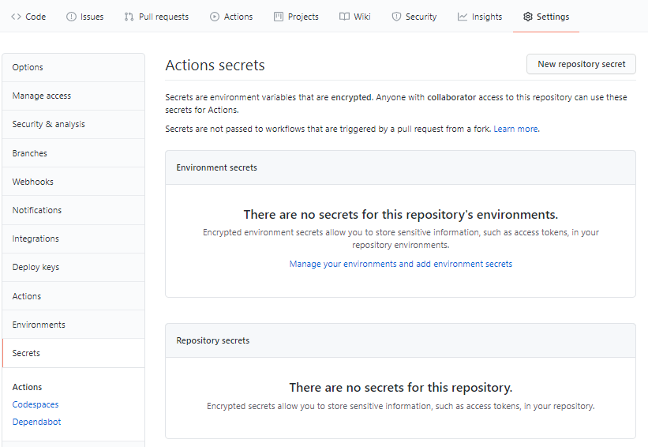

2. Click on 'New repository secret' button, enter 'AZURE_CREDENTIALS' in the Name field and copy/paste the JSON value associated with the service principal created with createrbacsp.sh.


3. Click on 'Add secret' button. The new secret will be accessible on the Secret page. 

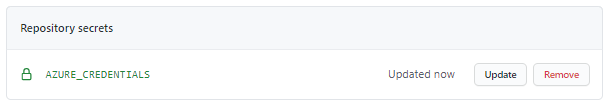

### Create Github Action pipeline for docker av-services
By default, all the Github Action pipelines are stored under 'pipelines/github-action'.
The docker av-services Github Action pipeline is [github-action.tests-docker.yml](pipelines/github-action/github-action.tests-docker.yml)

In order to activate this pipeline, follow the steps below:

1. Create a folder '.github/workflows' in your repository
2. Copy the file github-action.tests-docker.yml in the folder '.github/workflows'
3. Commit and push this modification in your main branch

```bash
   git add  .github/workflows/github-action.tests-docker.yml
   git commit -m "Create Docker av-services Github Action"
   git push
```

4. Once the new pipeline is pushed into the main branch, the Github Action is launched. On the github portal, on the 'Action' page, you can see the pipeline running.    

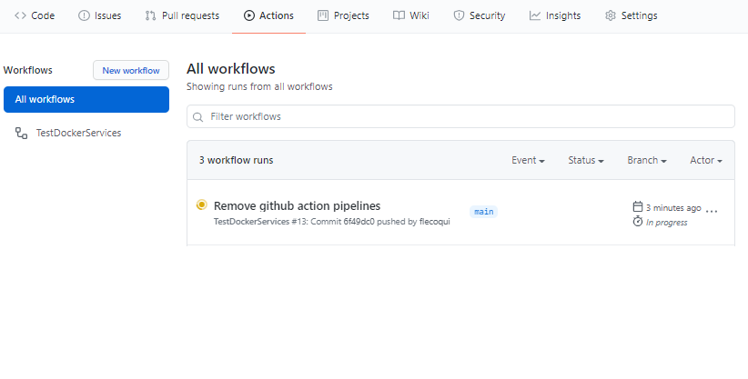

### Create Github Action pipeline for Azure Virtual Machine av-services
By default, all the Github Action pipelines are stored under 'pipelines/github-action'.
The docker av-services Github Action pipeline is [github-action.tests-azure-vm.yml](pipelines/github-action/github-action.tests-azure-vm.yml)

In order to activate this pipeline, follow the steps below:

1. Create a folder '.github/workflows' in your repository
2. Copy the file github-action.tests-azure-vm.yml in the folder '.github/workflows'
3. Commit and push this modification in your main branch

```bash
   git add  .github/workflows/github-action.tests-azure-vm.yml
   git commit -m "Create Azure VM av-services Github Action"
   git push
```

4. Once the new pipeline is pushed into the main branch, the Github Action is launched. On the github portal, on the 'Action' page, you can see the pipeline running.    

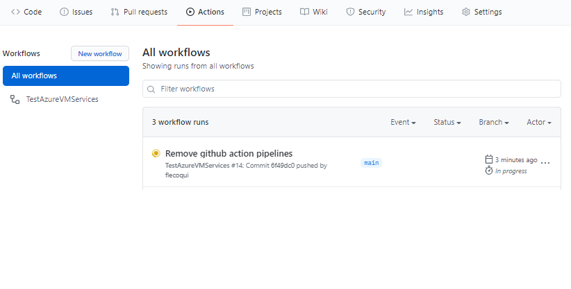
### Create Github Action pipeline for Azure Iot Edge Live Video Analytics av-services
By default, all the Github Action pipelines are stored under 'pipelines/github-action'.
The docker av-services Github Action pipeline is [github-action.tests-azure-iot-edge.yml](pipelines/github-action/github-action.tests-azure-iot-edge.yml)

In order to activate this pipeline, follow the steps below:

1. Create a folder '.github/workflows' in your repository
2. Copy the file github-action.tests-azure-iot-edge.yml in the folder '.github/workflows'
3. Commit and push this modification in your main branch

```bash
   git add  .github/workflows/github-action.tests-azure-iot-edge.yml
   git commit -m "Create Azure Iot Edge av-services Github Action"
   git push
```

4. Once the new pipeline is pushed into the main branch, the Github Action is launched. On the github portal, on the 'Action' page, you can see the pipeline running.    

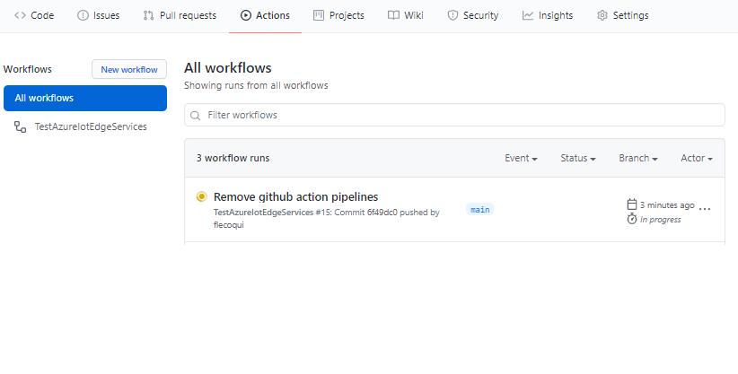


### Create Github Action pipeline results

After few minutes, the results will be displayed on the github portal, on the 'Action' page.


## Azure DevOps pipeline
You can use Azure DevOps to automate the integration tests of the following av-services:
- Docker av-services
- Azure virtual machine av-services
- Azure Iot Edge Live Video Analytics av-services

### Link your Azure DevOps project with the github repository

1. Navigate on your Azure DevOps organization https://dev.azure.com/YOUR_ORG
   
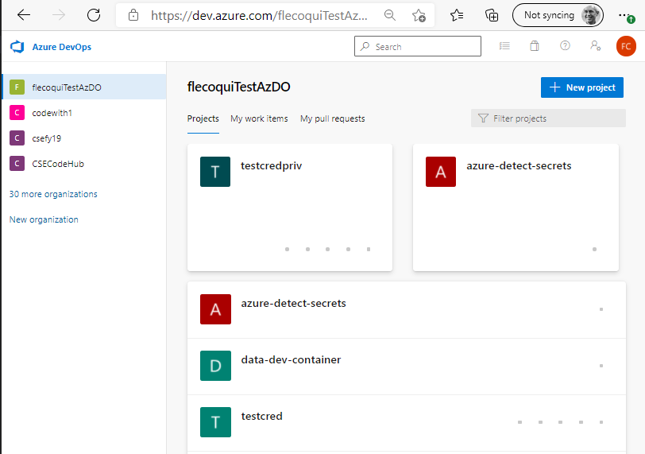

2. Click on the button '+ New project'

3. On the 'Create new project' page enter the name of your project and click on the button 'Create'

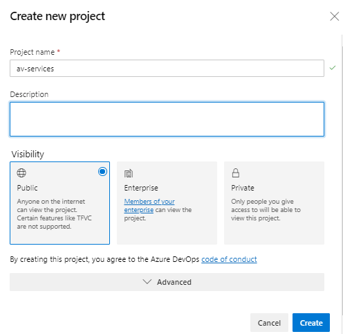

4. On the main page of your project on Azure DevOps portal, select 'Repos' -> 'Files' page.

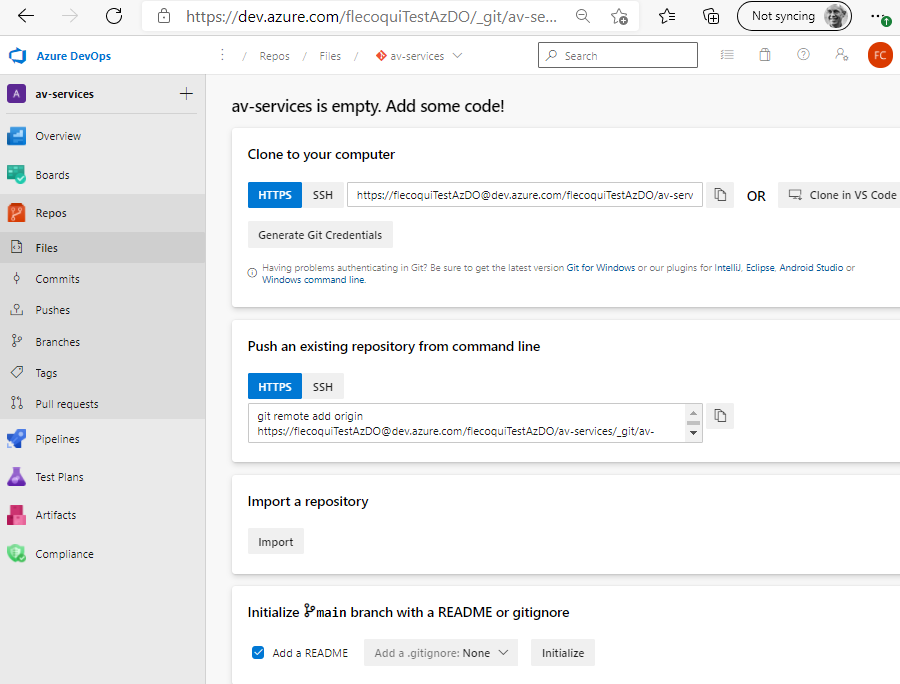

5. On this page, click on the 'import' button in the'Import a repository' section.

6. On the Import a Git repository page, enter the url of the git repository where you stored the source code of av-services.

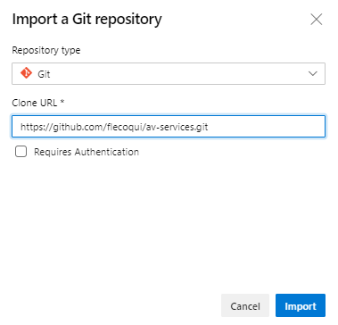

7. Click on the button 'Import', after few seconds the repository is imported. 

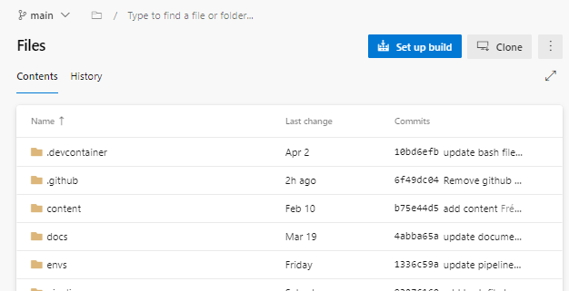

You can now create the service connection for the authentication with your Azure Account.
### Create Azure DevOps Service Connection

1. Navigate on your project home page on the Azure DevOps portal, select 'Project Settings' page.

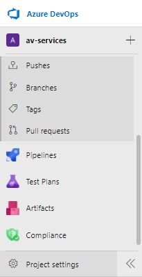

2. Select 'Service Connection' on the project settings page.

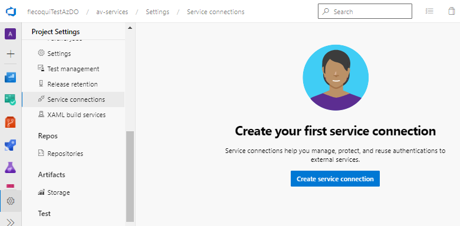

3. Click on the 'Create service connection' button.
4. On the 'New service connection' page, select 'Azure Resource manager' option: 

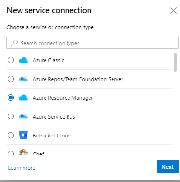

5. On the 'New service connection' page, select 'Service principal (manual)' option: 


6. On the 'New service connection' page, enter the value of the following fields:
Subscription Id, Subscription Name, Service Principal Id, Service principal key, Tenant Id and service connection name.
When all the fields are set, click on 'Verify and save' button: 

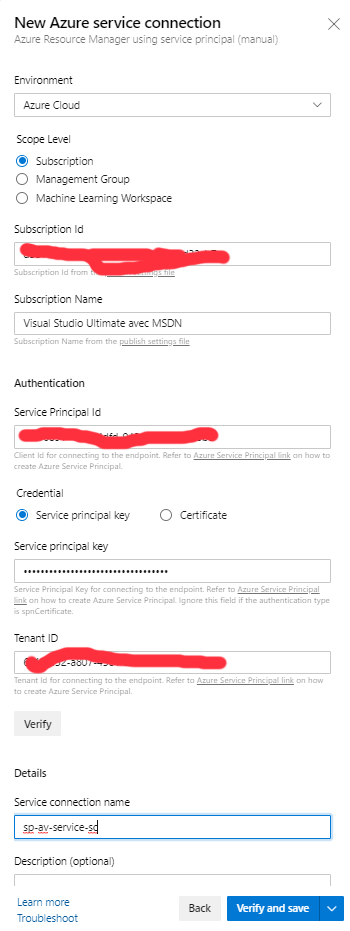

7. The new service connection is finally created and accessible for the new pipeline: 

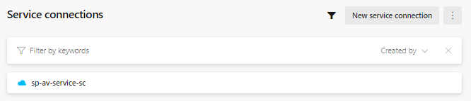

### Create Azure DevOps Variable Group 'av-services-vg'
The service connection is now created, by default the Azure Pipelines have been configured to get their service connection for the connection to Azure from a variable called 'serviceConnection' stored in the variable group 'av-services-vg'.

For instance, below the yaml file which defines the Azure Iot Edge pipeline:

```yaml
trigger:
  branches:
    include:
    - "main"
  paths:
    include:
    - envs/container/azure-iot-edge/*
    - src/lvatool/*
    - pipelines/azure-dev-ops/azure-pipelines.tests-azure-iot-edge.yml

variables:
  - name: configurationFile
    value:  'avtool.azure-iot-edge.env'
  - group: av-services-vg

pool:
  vmImage: 'ubuntu-20.04'

stages:
- stage: TestAzureIotEdgeServices
  displayName: Test Azure Iot Edge Services Stage
  jobs:
  - job: TestAzureIotEdgeServicesJob
    displayName: Test Azure Iot Edge Services Job
    steps:   
    - task: Bash@3
      displayName: 'Install Pre-requisites'
      inputs:
        targetType: 'inline'
        script: |
          pipelines/utils/avtool.sh -a install -c $(configurationFile) -e true 

    - task: AzureCLI@2
      displayName: Azure Authentication  
      inputs:
        azureSubscription: $(serviceConnection)
        scriptType: "bash"
        addSpnToEnvironment: "true"
        scriptLocation: "inlineScript"
        inlineScript: |
          echo "Service Principal Id: $servicePrincipalId"
          echo "Service Principal Key: $servicePrincipalKey"
          subscriptionId=$(az account show --query 'id' --output tsv)
          tenantId=$(az account show --query 'tenantId' --output tsv)
          echo "Tenant Id: $tenantId"
          echo "Subscription Id: $subscriptionId"

    - task: AzureCLI@2
      displayName: 'Integration Test Services'
      inputs:
        azureSubscription: $(serviceConnection)
        scriptType: "bash"
        addSpnToEnvironment: "true"
        scriptLocation: "inlineScript"
        inlineScript: |
          pipelines/utils/avtool.sh -a integration -c $(configurationFile) -e true -s true

```

1. Navigate on your project home page on the Azure DevOps portal, select 'Pipelines' -> 'Library' page.

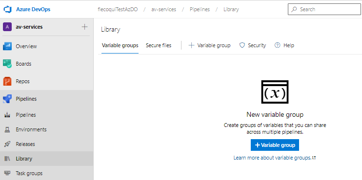

2. Click on the button '+ Variable group'. Enter the name of variable group 'av-services-vg'. Add the variable 'serviceConnection' with as value the name of the service connection which has been created during the step above. 

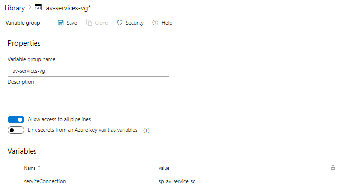

3. Don't forget to click on the button 'save' to create the new variable group which will be used by the new Azure DevOps pipeline.

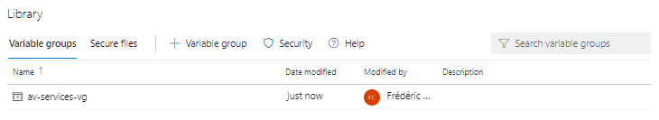

### Create and Run Azure DevOps pipeline for docker av-services
By default, all the Azure DevOps pipelines are stored under 'pipelines/azure-devops'.
The docker av-services Azure DevOps pipeline is [azure-devops.tests-docker.yml](pipelines/azure-dev-ops/azure-pipelines.tests-docker.yml)

In order to create this pipeline, follow the steps below:

1. Navigate on your project home page on the Azure DevOps portal, select 'Pipelines' -> 'Pipelines' page.

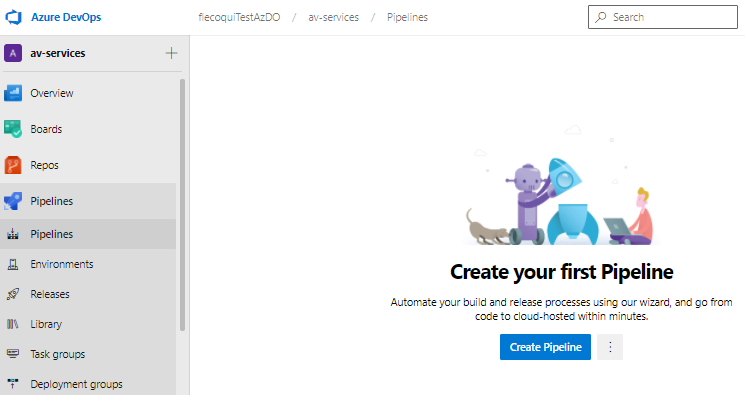

2. Click on the button 'Create pipeline'. On the 'Connect' property page, select the 'Azure Repos Git'.

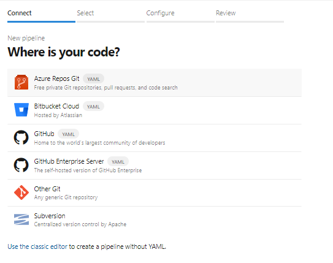

3. On the 'Select' property page, select the repository 'av-services'.

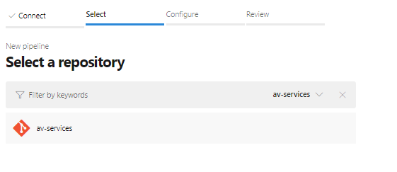

4. On the 'Configure' property page, select  'Existing Azure pipelines Yaml file'.

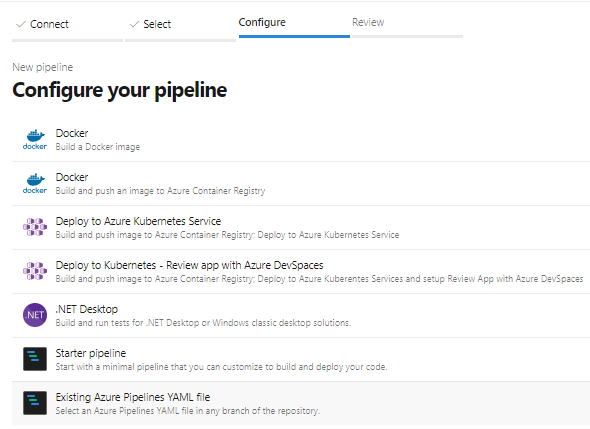

5. On the 'Select an existing YAML file' page, select the branch 'main' and the path of the docker av-services pipeline file: '/pipelines/azure-dev-ops/azure-pipelines.tests-docker.yml'. Click on the button 'Continue'


6. On the 'Review your pipeline YAML' page, select the item 'Save' in the 'Run' combo box.

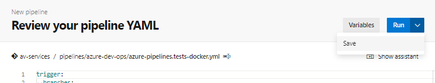

6. On the 'Review your pipeline YAML' page, select the item 'Save' in the 'Run' combo box.


7. Click on the 3 dots menu, and select menu item 'Rename/move'.

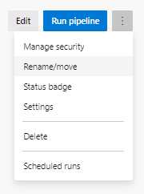

8. Enter the name of the new pipeline, and click on the button 'Save'

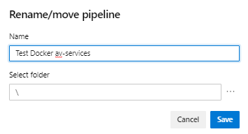

9. On the next page, click on the button 'Run pipeline'

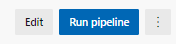

10. On the dialog box 'Run pipeline', select the 'main' branch and click on the button 'Run'

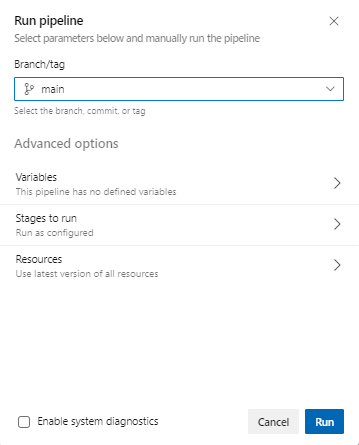

11. The pipeline is launched. 

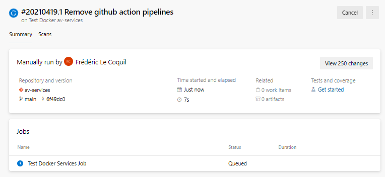

12. After several minutes, the test is completed and the results are displayed on the page 'Pipelines' -> 'Pipelines'.


### Create Azure and Run DevOps pipeline for Azure Virtual Machine av-services
To create the Test Azure Virtual Machine av-services pipeline, follow the same steps as for the creation of Docker av-services pipeline and use the following YAML pipeline file:  '/pipelines/azure-dev-ops/azure-pipelines.tests-azure-vm.yml'


### Create Azure and Run DevOps pipeline for Azure Iot Edge Live Video Analytics av-services
To create the Test Azure Iot Edge av-services pipeline, follow the same steps as for the creation of Docker av-services pipeline and use the following YAML pipeline file:  '/pipelines/azure-dev-ops/azure-pipelines.tests-azure-iot-edge.yml'


# Next Steps

Below a list of possible improvements:  

1. Automate Tests and deployment - to be delivered in March 2021
2. Add a HLS source
3. Add a RTSP source
4. Add components supporting smooth streaming
5. Provide Samples of Audio/Video renderer components
6. Provide Samples of Audio/Video splitter components supporting multicast
 
